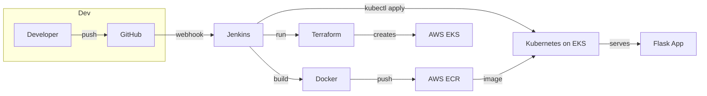

# DevOps Portfolio: Git → Jenkins → Docker → AWS ECR → Terraform → EKS → Flask Web App

## Project Title
Enterprise-grade CI/CD and Infrastructure Automation: Flask app deployed to AWS EKS with Terraform and Jenkins

## Description
This repository demonstrates a complete DevOps workflow: source in GitHub triggers Jenkins builds that build Docker images and push to AWS ECR, Terraform provisions networking/EKS/ECR resources, and Jenkins deploys the application to the EKS cluster. The project is educational and production-ready as a portfolio piece or interview demonstrator.

## Architecture (high-level)
Git (GitHub) → Jenkins (CI) → Docker build → AWS ECR (image registry) → Terraform (provision VPC/ECR/EKS) → kubectl (deploy) → EKS (Kubernetes) → Flask Web App

## Mermaid Flowchart

## Tech Stack Explanation
- Git / GitHub: Source control and webhook triggers.
- Jenkins: Central CI/CD orchestration (build, push, terraform apply, kubectl deploy). Jenkins integrates with credentials and scales with agents.
- Docker: Package the Flask web app into immutable containers.
- AWS ECR: Private container registry for storing images.
- Terraform: Provision AWS infra (VPC, ECR, EKS cluster, node groups).
- Kubernetes (EKS): Production-grade orchestration for the app.
- kubectl / kubeconfig: Used by Jenkins to apply Kubernetes manifests.

---

## Repository structure

- app/
  - app.py               # Flask application
  - requirements.txt     # Python deps
  - Dockerfile           # Multi-stage production Dockerfile
- k8s/
  - deployment.yaml      # Kubernetes Deployment manifest
  - service.yaml         # Kubernetes Service manifest
- terraform/
  - main.tf              # Provider, modules (VPC, EKS), ECR resource
  - variables.tf         # Terraform variables
  - outputs.tf           # Terraform outputs
  - versions.tf          # Terraform required providers and versions
- Jenkinsfile            # Declarative Jenkins pipeline
- scripts/
  - deploy_k8s.sh        # Small helper to apply k8s manifests via kubectl
- .gitignore
- README.md

---

## Step-by-step workflow (summary)
1. Developer pushes code to GitHub.
2. GitHub webhook triggers Jenkins job.
3. Jenkins pulls code, runs tests, builds Docker image and tags with commit SHA.
4. Jenkins logs into ECR and pushes the image.
5. Jenkins triggers Terraform (or Terraform step runs), provisioning EKS and ECR if not present.
6. Jenkins updates `k8s/deployment.yaml` (image tag) and runs `kubectl apply` to deploy to EKS.
7. App becomes available through the service load balancer.

---

## Prerequisites
- AWS account and IAM user with proper permissions (ECR, EKS, EC2, IAM, VPC, CloudWatch if used).
- Jenkins server with the following on executor node(s): Docker, kubectl, aws-cli (or AWS CLI v2), terraform.
- GitHub repository and webhook or GitHub Branch Source configuration for Jenkins.
- Jenkins credentials configured for AWS (recommended: IAM user access key) and for kubeconfig or a machine that can assume role to interact with EKS.
- local dev tools: docker, terraform, aws-cli, kubectl (for manual testing).

---

## Common errors & troubleshooting
- AWS permissions errors (AccessDenied): Ensure the IAM principal used by Jenkins/terraform has ECR, EKS, IAM, EC2, CloudWatch, and VPC permissions.
- ECR login failures: Ensure Jenkins uses `aws ecr get-login-password` with region and active AWS creds.
- kubeconfig / RBAC errors: Ensure kubeconfig used by Jenkins has cluster credentials and proper RBAC to create deployments/services and update resources.
- Terraform state lock or backend issues: Use remote state (S3 + DynamoDB) for team settings; local state is fine for demo but not production.
- Docker build fails on CI: Check memory and disk space on Jenkins agent; use resource-limited builds.

---

## Security best practices
- Do NOT store AWS keys in plaintext. Use Jenkins Credentials and bind them as environment variables or use the AWS Credentials plugin.
- Use IAM roles for EC2 (if Jenkins runs on EC2) or OIDC for GitHub Actions to avoid long-lived credentials.
- Limit ECR public access; use private repositories.
- Keep sensitive variables in Terraform remote state or secrets manager (not in git).
- Use image scanning on push (ECR image scanning or third-party tools).

---

## How to test and verify the deployment (quick)
1. Push a simple change to `app/app.py`.
2. Confirm Jenkins started a build and the pipeline completes.
3. Verify ECR has a new image tagged with the commit SHA.
4. Check Terraform applied and EKS is active (via console or `kubectl get nodes`).
5. Check deployment:
   - kubectl get pods -n default
   - kubectl get svc -n default
6. Access the LoadBalancer endpoint returned by the Service.

---

## Next steps & extensions
- Add blue/green or canary deployments with Argo Rollouts or Flagger.
- Add TLS/HTTPS with AWS ALB Ingress Controller or AWS LoadBalancer Controller.
- Add integration tests in Jenkins and promote to staging/production automatically.

---

(See files in the repo for `Jenkinsfile`, `terraform/`, `k8s/`, and `app/`.)
